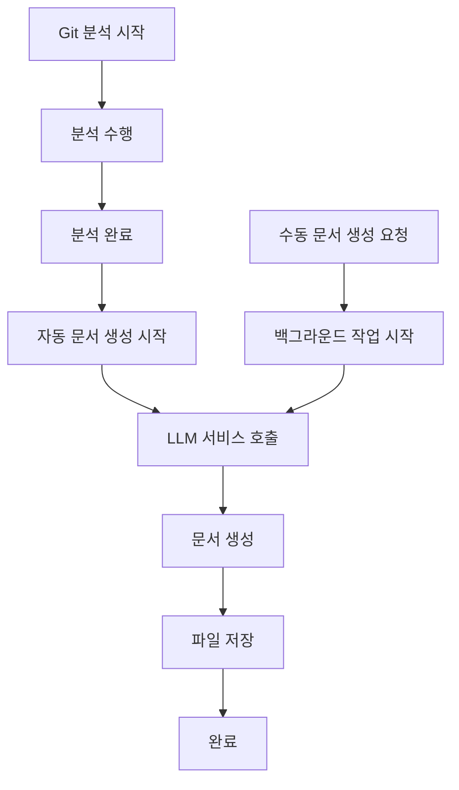

# 📄 LLM Document Generation Service

이 가이드는 새로 추가된 LLM 기반 문서 생성 기능에 대한 상세한 설명을 제공합니다.

## 🚀 개요

CoE RAG Pipeline에 LLM을 활용한 문서 자동 생성 기능이 추가되었습니다. 이 기능은 Git 레포지토리 분석 결과를 바탕으로 다양한 타입의 개발 문서를 자동으로 생성합니다.

## ✨ 주요 기능

### 🔄 자동 문서 생성
- **분석 완료 시 자동 실행**: Git 분석이 완료되면 자동으로 기본 문서들을 생성
- **백그라운드 처리**: 문서 생성은 비동기로 처리되어 API 응답 속도에 영향 없음
- **다중 문서 생성**: 한 번의 요청으로 여러 타입의 문서를 동시 생성

### 📋 지원 문서 타입

1. **development_guide**: 개발 가이드
   - 코딩 컨벤션
   - 아키텍처 패턴
   - 모범 사례

2. **api_documentation**: API 문서
   - 엔드포인트 설명
   - 요청/응답 예시
   - 사용법 가이드

3. **architecture_overview**: 아키텍처 개요
   - 시스템 구조
   - 컴포넌트 관계
   - 데이터 흐름

4. **code_review_summary**: 코드 리뷰 요약
   - 발견된 이슈
   - 개선 사항
   - 권장사항

5. **technical_specification**: 기술 명세서
   - 기술 스택
   - 의존성 정보
   - 버전 정보

6. **deployment_guide**: 배포 가이드
   - 환경 설정
   - 빌드 과정
   - 배포 단계

7. **troubleshooting_guide**: 문제 해결 가이드
   - 일반적 오류
   - 해결 방법
   - 디버깅 팁

## 🛠️ 구현 상세

### 1. LLM 서비스 (`services/llm_service.py`)

```python
class LLMDocumentService:
    """LLM을 활용한 문서 생성 서비스"""
    
    async def generate_document(
        self,
        analysis_data: Dict[str, Any],
        document_type: DocumentType,
        custom_prompt: Optional[str] = None,
        language: str = "korean"
    ) -> Dict[str, Any]:
        """단일 문서 생성"""
    
    async def generate_multiple_documents(
        self,
        analysis_data: Dict[str, Any],
        document_types: List[DocumentType],
        language: str = "korean"
    ) -> List[Dict[str, Any]]:
        """다중 문서 생성"""
```

### 2. API 엔드포인트 (`routers/document_generation.py`)

#### POST `/api/v1/documents/generate`
분석 결과를 바탕으로 문서를 생성합니다.

**요청 예시:**
```bash
curl -X POST "http://localhost:8001/api/v1/documents/generate" \
  -H "Content-Type: application/json" \
  -d '{
    "analysis_id": "3cbf3db0-fd9e-410c-bdaa-30cdeb9d7d6c",
    "document_types": ["development_guide", "api_documentation"],
    "language": "korean",
    "custom_prompt": "특히 FastAPI 관련 내용을 중심으로 작성해주세요."
  }'
```

**응답 예시:**
```json
{
  "task_id": "doc-task-uuid",
  "status": "pending",
  "message": "문서 생성이 시작되었습니다.",
  "analysis_id": "3cbf3db0-fd9e-410c-bdaa-30cdeb9d7d6c",
  "document_types": ["development_guide", "api_documentation"],
  "language": "korean"
}
```

#### GET `/api/v1/documents/status/{task_id}`
문서 생성 작업의 상태를 조회합니다.

#### GET `/api/v1/documents/types`
사용 가능한 문서 타입 목록을 반환합니다.

#### GET `/api/v1/documents/list/{analysis_id}`
특정 분석에 대해 생성된 문서 목록을 반환합니다.

#### DELETE `/api/v1/documents/delete/{analysis_id}`
특정 분석의 생성된 문서들을 삭제합니다.

### 3. 분석 워크플로우 통합

분석 서비스(`services/analysis_service.py`)에 자동 문서 생성 기능이 통합되었습니다:

```python
async def _generate_analysis_documents(self, analysis_id: str, analysis_result):
    """분석 완료 후 LLM을 사용하여 문서를 자동 생성합니다."""
    
    # 기본 문서 타입들 자동 생성
    default_document_types = [
        DocumentType.DEVELOPMENT_GUIDE,
        DocumentType.TECHNICAL_SPECIFICATION,
        DocumentType.ARCHITECTURE_OVERVIEW
    ]
```

## 📁 파일 구조

```
CoE-RagPipeline/
├── services/
│   └── llm_service.py              # LLM 문서 생성 서비스
├── routers/
│   └── document_generation.py     # 문서 생성 API 엔드포인트
├── models/
│   └── schemas.py                 # 문서 생성 관련 스키마 추가
├── output/
│   └── documents/                 # 생성된 문서 저장 디렉토리
│       └── {analysis_id}/         # 분석별 문서 폴더
│           ├── development_guide_korean.md
│           ├── api_documentation_korean.md
│           └── ...
└── main.py                        # 문서 생성 라우터 추가
```

## 🔧 설정

### 환경 변수
```bash
# OpenAI API 키 (필수)
export OPENAI_API_KEY="your-openai-api-key"
```

### 설정 파일 (`config/settings.py`)
```python
class Settings:
    # OpenAI 설정
    OPENAI_API_KEY: Optional[str] = os.getenv("OPENAI_API_KEY")
    
    # 디렉토리 설정
    DOCUMENTS_DIR: str = "output/documents"
```

## 🚀 사용 방법

### 1. 기본 사용법 (자동 생성)

1. Git 분석 시작:
```bash
curl -X POST "http://localhost:8001/api/v1/analyze" \
  -H "Content-Type: application/json" \
  -d '{
    "repositories": [
      {
        "url": "https://github.com/example/repo.git",
        "branch": "main"
      }
    ],
    "include_ast": true,
    "include_tech_spec": true
  }'
```

2. 분석 완료 후 자동으로 다음 문서들이 생성됩니다:
   - `development_guide_korean.md`
   - `technical_specification_korean.md`
   - `architecture_overview_korean.md`

### 2. 수동 문서 생성

1. 분석 완료 후 추가 문서 생성:
```bash
curl -X POST "http://localhost:8001/api/v1/documents/generate" \
  -H "Content-Type: application/json" \
  -d '{
    "analysis_id": "your-analysis-id",
    "document_types": ["deployment_guide", "troubleshooting_guide"],
    "language": "english"
  }'
```

2. 생성 상태 확인:
```bash
curl -X GET "http://localhost:8001/api/v1/documents/status/{task_id}"
```

3. 생성된 문서 목록 확인:
```bash
curl -X GET "http://localhost:8001/api/v1/documents/list/{analysis_id}"
```

## 🔍 문서 품질

### 프롬프트 엔지니어링
- **시스템 프롬프트**: 각 문서 타입별로 최적화된 전문가 역할 설정
- **사용자 프롬프트**: 분석 데이터를 구조화하여 제공
- **컨텍스트 제공**: 저장소 정보, 기술 스택, AST 분석 결과 포함

### 생성 모델
- **모델**: GPT-4o-mini (비용 효율적)
- **온도**: 0.7 (창의성과 일관성의 균형)
- **최대 토큰**: 4000 (충분한 문서 길이)

## 🧪 테스트

### 구조 테스트
```bash
python3 test_structure.py
```

### 전체 기능 테스트 (의존성 설치 후)
```bash
# 1. 의존성 설치
pip install -r requirements.txt

# 2. 환경 변수 설정
export OPENAI_API_KEY="your-key"

# 3. 서버 시작
python3 main.py

# 4. 브라우저에서 API 문서 확인
open http://localhost:8001/docs
```

## 🔄 워크플로우



## 📊 모니터링

### 로그 확인
```bash
# 문서 생성 관련 로그 확인
tail -f server.log | grep "Document generation"
```

### 생성된 문서 확인
```bash
# 특정 분석의 문서 목록
ls -la output/documents/{analysis_id}/

# 문서 내용 확인
cat output/documents/{analysis_id}/development_guide_korean.md
```

## 🚨 문제 해결

### 일반적인 오류

1. **OpenAI API 키 오류**
   ```
   ValueError: OPENAI_API_KEY가 설정되지 않았습니다.
   ```
   **해결**: 환경 변수 `OPENAI_API_KEY` 설정

2. **분석 결과 없음**
   ```
   404: 분석 결과를 찾을 수 없습니다.
   ```
   **해결**: 먼저 `/api/v1/analyze`로 분석 수행

3. **문서 생성 실패**
   - 로그에서 상세 오류 확인
   - OpenAI API 할당량 확인
   - 네트워크 연결 확인

## 🔮 향후 개선 사항

1. **문서 템플릿 커스터마이징**
2. **다양한 LLM 모델 지원**
3. **문서 버전 관리**
4. **문서 품질 평가 메트릭**
5. **실시간 문서 업데이트**

---

이 문서 생성 기능을 통해 개발팀은 코드 분석 결과를 바탕으로 고품질의 기술 문서를 자동으로 생성할 수 있습니다. 🚀